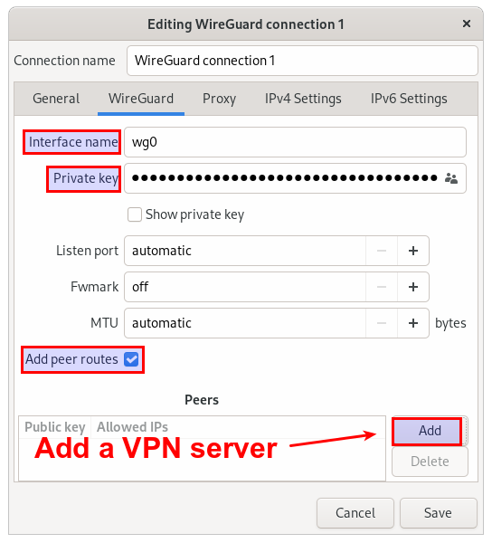
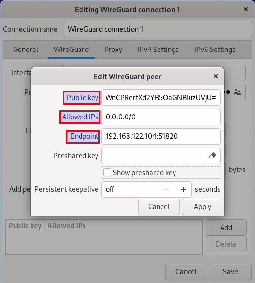
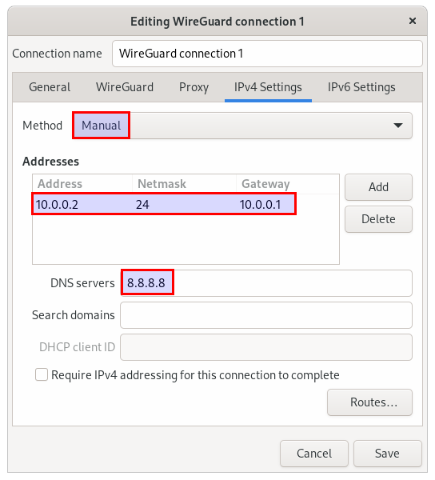

# WireGuard

WireGuard is an fast and modern VPN that utilizes state-of-the-art cryptography.

## Client Setup

Install WireGuard on your client:

```bash
sudo pacman -S wireguard-tools
```

Get client private key from server:

```bash
cat $DOCKER_DATA/wireguard/peer1/privatekey-peer1
```

Get server public key:

```bash
cat $DOCKER_DATA/wireguard/server/publickey-server
```

Add the client private key and set an free interface name:



Add server endpoint address and server public key.



Set IP to `10.13.13.x`. with `x = peer_number + 1`. I recommend to set the DNS Server to the opnsense/adguard IP to get the local DNS rebinds.


